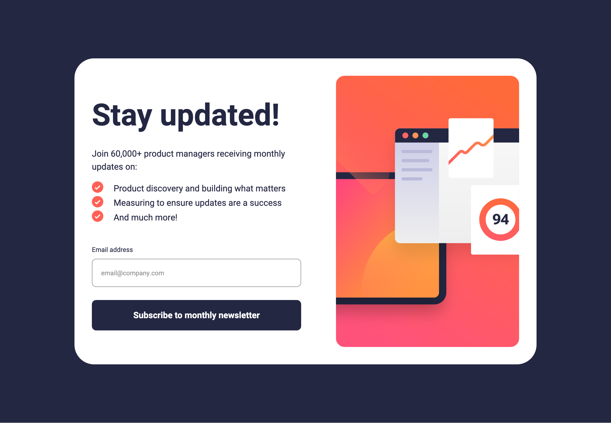

# Frontend Mentor - Newsletter sign-up form with success message solution

This is a solution to the [Newsletter sign-up form with success message challenge on Frontend Mentor](https://www.frontendmentor.io/challenges/newsletter-signup-form-with-success-message-3FC1AZbNrv). Frontend Mentor challenges help you improve your coding skills by building realistic projects.

## Table of contents

- [Overview](#overview)
  - [The challenge](#the-challenge)
  - [Screenshot](#screenshot)
  - [Links](#links)
- [My process](#my-process)
  - [Built with](#built-with)
  - [What I learned](#what-i-learned)
  - [Continued development](#continued-development)
  - [Useful resources](#useful-resources)
- [Author](#author)

**Note: Delete this note and update the table of contents based on what sections you keep.**

## Overview

### The challenge

Users should be able to:

- Add their email and submit the form
- See a success message with their email after successfully submitting the form
- See form validation messages if:
  - The field is left empty
  - The email address is not formatted correctly
- View the optimal layout for the interface depending on their device's screen size
- See hover and focus states for all interactive elements on the page

### Screenshot

### Links

- Solution URL: [https://www.frontendmentor.io/solutions/newsletter-sign-up-with-success-message-using-javascript-yd_m8tuEie)
- Live Site URL: [https://rainbowsurfer137.github.io/newsletter-sign-up-with-success-message/)

## My process

### Built with

- CSS custom properties
- CSS Grid
- Mobile-first workflow
- JavaScript

### What I learned

I learned how to use CSS to syle the error state for the email input feild and how to use JavaScript for the success popup window.

### Continued development

I’d like to deepen my understanding of JavaScript and focus on writing more efficient, maintainable code. This includes improving how I structure logic, handle user interactions, and apply best practices to keep my code clean and scalable.

### Useful resources

- [https://www.youtube.com/watch?v=Z0duh-0xJ2Y](https://www.youtube.com/watch?v=Z0duh-0xJ2Y) - This helped me with writing the css, specificaly the error state.

## Author

- Frontend Mentor - [@rainbowsurfer137](https://www.frontendmentor.io/profile/rainbowsurfer137)
